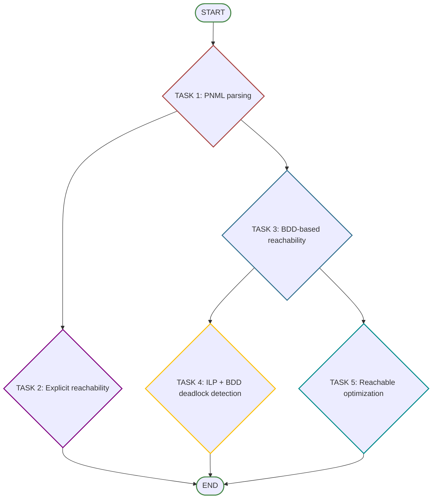

 Symbolic and Algebraic Reasoning in Petri Nets 


## Giới thiệu dự án

Dự án này là một bộ công cụ dùng để mô hình hóa và phân tích **Mạng Petri (Petri Nets)**, đặc biệt tập trung vào mạng **1-safe**. Mục tiêu chính của dự án là giải quyết bài toán bùng nổ không gian trạng thái thông qua các kỹ thuật suy diễn đại số và ký hiệu.

Hệ thống được thiết kế để đọc dữ liệu từ định dạng **PNML** và xử lí theo hai hướng phân tích song song:
1.  **Phương pháp Liệt kê (Explicit approach):** Sử dụng các thuật toán duyệt đồ thị BFS và DFS để khám phá toàn bộ không gian trạng thái.
2.  **Phương pháp Ký hiệu (Symbolic approach):** Sử dụng **Binary Decision Diagrams (BDD)** thông qua thư viện `PyEDA` để biểu diễn và xử lý không gian trạng thái lớn một cách hiệu quả.

### Các bài toán được giải quyết:
* **Phân tích Reachability:** Xác định tất cả các trạng thái mà hệ thống có thể đạt được từ trạng thái ban đầu.
* **Phát hiện Deadlock:** Tìm kiếm các trạng thái "chết" nơi hệ thống bị dừng hoạt động hoàn toàn, kết hợp giữa BDD và kiểm tra điều kiện kích hoạt.
* **Tối ưu hóa:** Tìm kiếm trạng thái đạt tới thỏa mãn hàm mục tiêu lớn nhất ($c^T \cdot M$) bằng thuật toán quy hoạch động trên cấu trúc BDD.

## Cấu trúc thư mục:
```sh
src/
│── PetriNet.py
│── BFS.py
│── DFS.py
│── BDD.py
│── Deadlock.py
│── Optimization.py
│
tests/
│── test_petriNet.py
│── test_BFS.py
│── test_DFS.py
│── test_BDD.py
│── test_Deadlock.py
│── test_Optimization.py
│
run.py
example.pnml
requirements.txt
README.md

```
## Mô tả:
- `PetriNet.py` - Phân tích PNML:
  + Đọc file PNML chuẩn 2009 → tạo lớp `PetriNet`
  + Trích xuất:
    + Danh sách Place / Transition (ID + Tên)
    + Ma trận Input I
    + Ma trận Output O
    + Marking khởi tạo M0
  + Hỗ trợ namespace và trọng số arc.
  + Xuất thông tin mạng bằng `__str__`.
  + Chạy thử:
    ```sh
    py -m pytest tests/test_petriNet.py -v


- `BFS & DFS Reachability`:
  + BFS (`BFS.py`)
    + Liệt kê toàn bộ reachable markings theo chiều rộng.
    + Đảm bảo đầy đủ và tối thiểu.
  + DFS (`DFS.py`):
    + Kiểm tra lại không gian reachable theo chiều sâu.
  + Chạy thử: 
    ```sh
    py -m pytest tests/test_BFS.py -v
    ```
    &
    ```sh
    py -m pytest tests/test_DFS.py -v
    ```

- `BDD.py` - Biểu diễn Ký hiệu (Symbolic):
  + Sử dụng thư viện `pyeda` để xây dựng Binary Decision Diagram (BDD).
  + Chuyển đổi tập Reachable Markings (từ BFS) thành biểu thức logic Boolean nén.
  + Cơ chế mã hóa: 
    + Mỗi Place tương ứng với một biến Boolean.
    + Mỗi Marking là một tích logic.
    + BDD tổng hợp là tổng logic của các trạng thái.
  + Trả về đối tượng BDD và tổng số lượng trạng thái đếm được.
  + Chạy thử:
    ```sh
    py -m pytest tests/test_BDD.py -v
    ```

- `Deadlock.py` - Phát hiện deadlock:
  + Tìm kiếm một trạng thái Deadlock (nơi hệ thống dừng, không transition nào enabled).
  + Kiểm tra kết hợp các điều kiện:
    + Trạng thái phải thuộc tập Reachable (check qua BDD).
    + Tuân thủ tính chất 1-safe.
    + Không có transition nào thỏa mãn điều kiện fire.
  + Chạy thử:
    ```sh
    py -m pytest tests/test_Deadlock.py -v
    ```

- `Optimization.py` - Tối ưu hóa trọng số:
  + Giải quyết bài toán tìm Marking $M$ sao cho tổng trọng số $c^T \cdot M$ là lớn nhất.
  + Áp dụng thuật toán Quy hoạch động (Dynamic Programming) trực tiếp trên cấu trúc cây BDD.
  + Quy trình:
    + Bước 1 (Bottom-up): Tính giá trị lợi nhuận cực đại tại mỗi node.
    + Bước 2 (Top-down): Truy vết đường đi để dựng lại Marking tối ưu.
  + Xử lý chính xác các biến bị lược bỏ trong BDD.
  + Chạy thử:
    ```sh
    py -m pytest tests/test_Optimization.py -v
    ```

## Tải phần mềm cần thiết

- Tải python phiên bản 3.11 (hoặc 3.10) cho window 64 bit
> Lưu ý: nhớ tích chọn thêm PATH cho python khi cài đặt
```
https://www.python.org/ftp/python/3.11.9/python-3.11.9-amd64.exe
```

- Tải graphviz để tạo hình ảnh (phiên bản 14.0.5 cho window 64bit)
> Lưu ý: nhớ tích chọn thêm PATH cho graphviz khi cài đặt
```
https://gitlab.com/api/v4/projects/4207231/packages/generic/graphviz-releases/14.0.5/windows_10_cmake_Release_graphviz-install-14.0.5-win64.exe
```

## Sử dụng chương trình
### Trước khi chạy

- Huỷ file venv cũ (nếu có)
```
deactivate
```

- Xoá file venv cũ (nếu có)
```
Remove-Item -Recurse -Force venv
```

- Tạo môi trường ảo (virtual environment)
> Nếu sử dụng python từ Microsoft Store, chạy lệnh sau: 
```sh
python3 -m venv venv
```
> Nếu lệnh trên không chạy được thì chạy lệnh sau:
```sh
py -m venv venv
```
> Nếu máy có nhiều phiên bản python, chạy lệnh sau:
```sh
py -3.11 -m venv venv
```

- Kích hoạt môi trường ảo
```sh
# Windows
venv\Scripts\Activate.ps1

# Linux / macOS:
source venv/bin/activate
```

- Cài đặt các thư viện từ `requirements.txt`
```sh
pip install -r requirements.txt
```

- Cài đặt thư viện Pyeda (trong trường hợp bị lỗi khi cài trong file requirements)
```sh
pip install pyeda
```

### Chạy Code

```sh
py run.py
```

###  Chạy các tests

- Chạy tất cả các tests
```sh
py -m pytest tests/ -v
```

- Chạy một file test

```sh
py -m pytest tests/test_petriNet.py -v
```

- Chạy một testcase

```sh
py -m pytest tests/test_petriNet.py::test_001 -v
```

- Chạy testcase cho từng hàm nhỏ:

  + BDD:
    ```sh
    py -m pytest tests/test_BDD.py -v
    ```

  + BFS:
    ```sh
    py -m pytest tests/test_BFS.py -v
    ```

  + DFS:
    ```sh
    py -m pytest tests/test_DFS.py -v
    ```

  + Deadlock:
    ```sh
    py -m pytest tests/test_Deadlock.py -v
    ```

  + Optimization:
    ```sh
    py -m pytest tests/test_Optimization.py -v
    ```
