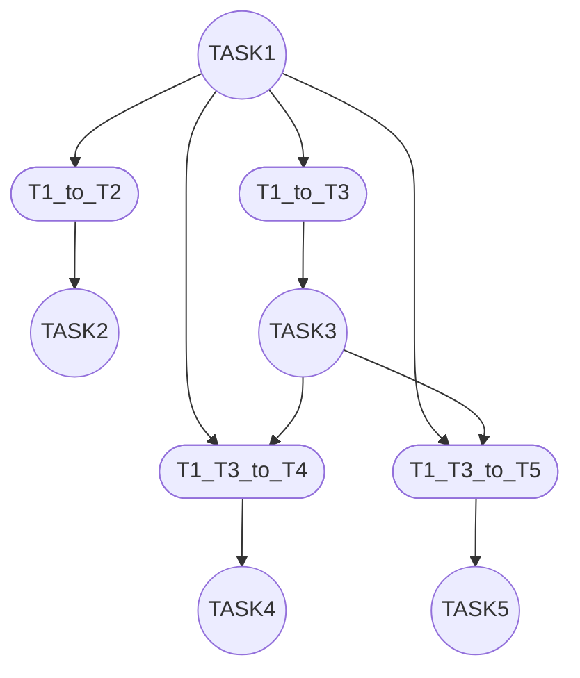

 Symbolic and Algebraic Reasoning in Petri Nets 



## Installing

- Tải python phiên bản 3.11 (hoặc 3.10) cho window 64 bit
> Lưu ý: nhớ tích chọn thêm PATH cho python khi cài đặt
```
https://www.python.org/ftp/python/3.11.9/python-3.11.9-amd64.exe
```

- Tải graphviz để tạo hình ảnh (phiên bản 14.0.5 cho window 64bit)
> Lưu ý: nhớ tích chọn thêm PATH cho graphviz khi cài đặt
```
https://gitlab.com/api/v4/projects/4207231/packages/generic/graphviz-releases/14.0.5/windows_10_cmake_Release_graphviz-install-14.0.5-win64.exe
```

## Requirements

- Tạo môi trường ảo (virtual environment)
```sh
python3 -m venv venv
```
> Nếu không chạy được thì chạy lệnh sau
```sh
py -m venv venv
```
> Nếu máy có nhiều phiên bản python, chạy lệnh
```sh
py -3.11 -m venv venv
```


- Kích hoạt môi trường ảo
```sh
# Windows
venv\Scripts\Activate.ps1

# Linux / macOS:
source venv/bin/activate
```

- Cài đặt các thư viện từ `requirements.txt`
```sh
pip install -r requirements.txt
```

## Chạy Code

```sh
py run.py
```

##  Chạy tests

- Chạy tất cả các tests
```sh
py -m pytest tests/ -v
```

- Chạy một file test

```sh
py -m pytest tests/test_petriNet.py -v
```

- Chạy một testcase

```sh
py -m pytest tests/test_petriNet.py::test_001 -v
```
